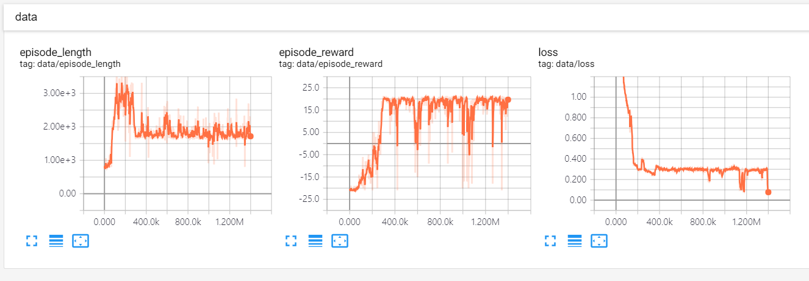

# RL_PyTorch_DQN

An implementation of RL algorithms in PyTorch. A lot of codes are borrowed from [baselines](https://github.com/openai/baselines), [NoisyNet-A3C](https://github.com/Kaixhin/NoisyNet-A3C), [RL-Adventure](https://github.com/higgsfield).

## Deep Q-Learning

List of papers are:

1. Mnih, V., Kavukcuoglu, K., Silver, D., Rusu, A. A., Veness, J., Bellemare, M. G., et al. (2015). [Human-level control through deep reinforcement learning](https://www.nature.com/articles/nature14236). Nature, 518(7540), 529. http://doi.org/10.1038/nature14236

2. van Hasselt, H., Guez, A., & Silver, D. (2015, September 22). [Deep Reinforcement Learning with Double Q-learning](https://arxiv.org/abs/1509.06461). arXiv.org.

3. Schaul, T., Quan, J., Antonoglou, I., & Silver, D. (2015, November 19). [Prioritized Experience Replay](https://arxiv.org/abs/1511.05952). arXiv.org.

4. Wang, Z., Schaul, T., Hessel, M., van Hasselt, H., Lanctot, M., & de Freitas, N. (2015, November 20). [Dueling Network Architectures for Deep Reinforcement Learning](https://arxiv.org/abs/1511.06581). arXiv.org.

5. Fortunato, M., Azar, M. G., Piot, B., Menick, J., Osband, I., Graves, A., et al. (2017, July 1). [Noisy Networks for Exploration](https://arxiv.org/abs/1706.10295). arXiv.org.

6. Hessel, M., Modayil, J., van Hasselt, H., Schaul, T., Ostrovski, G., Dabney, W., et al. (2017, October 6). [Rainbow: Combining Improvements in Deep Reinforcement Learning](https://arxiv.org/abs/1710.02298). arXiv.org.

## Requirements
```
torch
torchvision
numpy
tensorboardX
```

I tested code on source built torch-v1.0 with CUDA10.0.

## Examples

You can specify environment with `--env`
```
python main.py --env PongNoFrameskip-v4
```

You can use RL algorithms with below arguments
```
python main.py --double --dueling --noisy --c51 --prioritized-replay
```

## Results

This is tensorboard scalars with Rainbow(`--double --dueling --noisy --c51 --prioritized-replay`)



You can enjoy the pretrained model with command

```
python main.py --evaluate --render --double --dueling --noisy --c51 --prioritized-replay
```


## Acknowledgements
- Kalxhin(https://github.com/Kaixhin/NoisyNet-A3C)
- higgsfield(https://github.com/higgsfield)
- openai(https://github.com/openai/baselines)